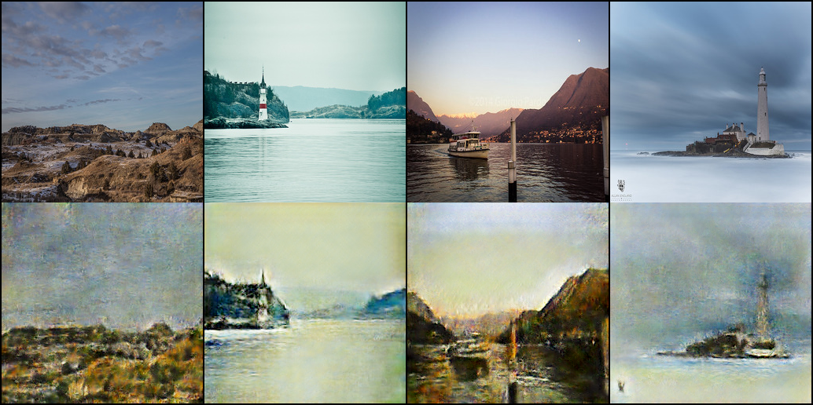

# cyclegan-pytorch
This repository is a deep-running part of a program that changes the style of a photo. And I refer to the following paper.
<p>[A reference article] (https://arxiv.org/abs/1703.10593)</p>

## preparing dataset
We used the supplied cycleGAN dataset.You can download datasets from this link.(https://people.eecs.berkeley.edu/~taesung_park/CycleGAN/datasets/)  

organize image following structure
example) monet2photo
```
dataset/
    photo/
        0001.jpg
        0002.jpg
        0003.jpg
        0004.jpg
        ...
    monet/
        0001.jpg
        0002.jpg
        0003.jpg
        0004.jpg
        ...
```

or run python file
```bash
python main.py --style monet2photo
```
## how to train
run main file
example) monet2photo
```bash
python main.py --real_image_b photo --to_style monet
```

## how to get sample
Once you have structured the dataset, you can train it by running the test in the Tester class. then sample image will be stored in samples

## Sample
